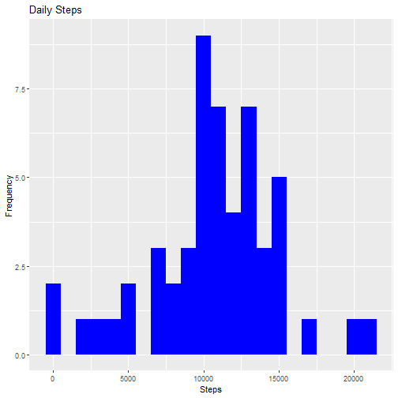
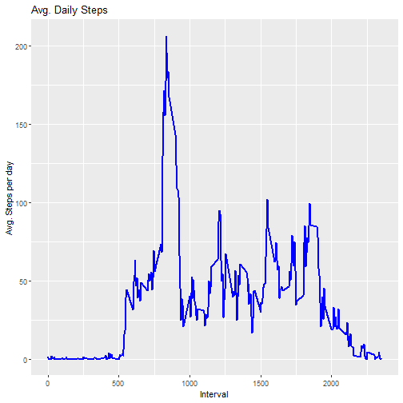
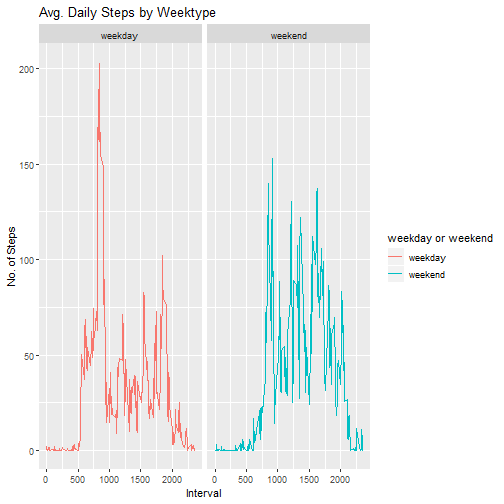
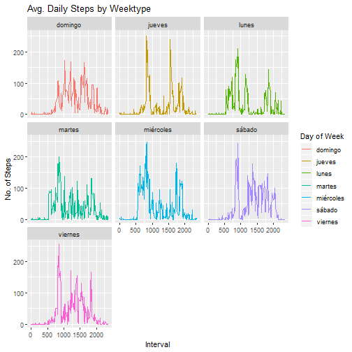

<!-- rmarkdown v1 -->

## Introduction
It is now possible to collect a large amount of data about personal movement using activity monitoring devices such as a Fitbit, Nike Fuelband, or Jawbone Up. These type of devices are part of the “quantified self” movement – a group of enthusiasts who take measurements about themselves regularly to improve their health, to find patterns in their behavior, or because they are tech geeks. But these data remain under-utilized both because the raw data are hard to obtain and there is a lack of statistical methods and software for processing and interpreting the data.

This assignment makes use of data from a personal activity monitoring device. This device collects data at 5 minute intervals through out the day. The data consists of two months of data from an anonymous individual collected during the months of October and November, 2012 and include the number of steps taken in 5 minute intervals each day.

The data for this assignment can be downloaded from the course web site:

* Dataset: [Activity monitoring data](https://d396qusza40orc.cloudfront.net/repdata%2Fdata%2Factivity.zip) 

The variables included in this dataset are:

steps: Number of steps taking in a 5-minute interval (missing values are coded as 𝙽𝙰) </br>
date: The date on which the measurement was taken in YYYY-MM-DD format </br>
interval: Identifier for the 5-minute interval in which measurement was taken </br>
The dataset is stored in a comma-separated-value (CSV) file and there are a total of 17,568 observations in this dataset. 

## Commit containing the submission
## 1. Code for reading in the dataset and/or processing the data.

```r
library(data.table)
library(ggplot2)

path <- getwd()
fileUrl <- "https://d396qusza40orc.cloudfront.net/repdata%2Fdata%2Factivity.zip"
download.file(fileUrl, destfile = paste(path, "/repdata%2Fdata%2Factivity.zip", sep = "/"))
unzip(zipfile = "repdata%2Fdata%2Factivity.zip")
activityDT <- data.table::fread(input = "activity.csv")
```

## 2. Histogram of the total number of steps taken each day

First, calculate the total number of steps taken per day and finally make a histogram of the total number of steps taken each day. 


```r
Total_Steps <- activityDT[, c(lapply(.SD, sum, na.rm = FALSE)), .SDcols = c("steps"), by = .(date)] 
head(Total_Steps, 5)
```

```
##          date steps
## 1: 2012-10-01    NA
## 2: 2012-10-02   126
## 3: 2012-10-03 11352
## 4: 2012-10-04 12116
## 5: 2012-10-05 13294
```

```r
ggplot(Total_Steps, aes(x = steps)) +
    geom_histogram(fill = "blue", binwidth = 1000) +
    labs(title = "Daily Steps", x = "Steps", y = "Frequency")
```

```
## Warning: Removed 8 rows containing non-finite values (stat_bin).
```



## 3. Mean and median number of steps taken each day


```r
Total_Steps[, .(Mean_Steps = mean(steps, na.rm = TRUE), Median_Steps = median(steps, na.rm = TRUE))]
```

```
##    Mean_Steps Median_Steps
## 1:   10766.19        10765
```

## 4. Time series plot of the average number of steps taken
Make a time series plot (i.e. 𝚝𝚢𝚙𝚎 = "𝚕") of the 5-minute interval (x-axis) and the average number of steps taken, averaged across all days (y-axis)


```r
IntervalDT <- activityDT[, c(lapply(.SD, mean, na.rm = TRUE)), .SDcols = c("steps"), by = .(interval)] 
ggplot(IntervalDT, aes(x = interval , y = steps)) + 
  geom_line(color = "blue", size = 1) + 
  labs(title = "Avg. Daily Steps", x = "Interval", y = "Avg. Steps per day")
```



## 5. The 5-minute interval that, on average, contains the maximum number of steps


```r
IntervalDT[steps == max(steps), .(max_interval = interval)]
```

```
##    max_interval
## 1:          835
```

## 6. Code to describe and show a strategy for imputing missing data
Calculate and report the total number of missing values in the dataset (i.e. the total number of rows with 𝙽𝙰s)


```r
activityDT[is.na(steps), .N ]
```

```
## [1] 2304
```

```r
# alternative solution
nrow(activityDT[is.na(steps),])
```

```
## [1] 2304
```

Devise a strategy for filling in all of the missing values in the dataset. The strategy does not need to be sophisticated. For example, you could use the mean/median for that day, or the mean for that 5-minute interval, etc.


```r
# Filling in missing values with median of dataset. 
activityDT[is.na(steps), "steps"] <- activityDT[, c(lapply(.SD, median, na.rm = TRUE)), .SDcols = c("steps")]
```

Create a new dataset that is equal to the original dataset but with the missing data filled in.


```r
data.table::fwrite(x = activityDT, file = "TidyData.csv", quote = FALSE)
```


## 7. Histogram of the total number of steps taken each day after missing values are imputed

Make a histogram of the total number of steps taken each day and calculate and report the mean and median total number of steps taken per day. Do these values differ from the estimates from the first part of the assignment? What is the impact of imputing missing data on the estimates of the total daily number of steps?


```r
# total number of steps taken per day
Total_Steps <- activityDT[, c(lapply(.SD, sum)), .SDcols = c("steps"), by = .(date)] 
# mean and median total number of steps taken per day
Total_Steps[, .(Mean_Steps = mean(steps), Median_Steps = median(steps))]
```

```
##    Mean_Steps Median_Steps
## 1:    9354.23        10395
```

```r
ggplot(Total_Steps, aes(x = steps)) + 
  geom_histogram(fill = "blue", binwidth = 1000) + 
  labs(title = "Daily Steps", x = "Steps", y = "Frequency")
```


Create a new factor variable in the dataset with two levels – “weekday” and “weekend” indicating whether a given date is a weekday or weekend day.


```r
# Just recreating activityDT from scratch then making the new factor variable. (No need to, just want to be clear on what the entire process is.) 
activityDT <- data.table::fread(input = "tidyData.csv")
activityDT[, date := as.POSIXct(date, format = "%Y-%m-%d")]
activityDT[, `Day of Week`:= weekdays(x = date)]
activityDT[grepl(pattern = "lunes|martes|miércoles|jueves|viernes", x = `Day of Week`), "weekday or weekend"] <- "weekday"
activityDT[grepl(pattern = "sábado|domingo", x = `Day of Week`), "weekday or weekend"] <- "weekend"
activityDT[, `weekday or weekend` := as.factor(`weekday or weekend`)]
head(activityDT, 5)
```

```
##    steps       date interval Day of Week weekday or weekend
## 1:     0 2012-10-01        0       lunes            weekday
## 2:     0 2012-10-01        5       lunes            weekday
## 3:     0 2012-10-01       10       lunes            weekday
## 4:     0 2012-10-01       15       lunes            weekday
## 5:     0 2012-10-01       20       lunes            weekday
```

## 8. Panel plot comparing the average number of steps taken per 5-minute interval across weekdays and weekends
Make a panel plot containing a time series plot (i.e. 𝚝𝚢𝚙𝚎 = "𝚕") of the 5-minute interval (x-axis) and the average number of steps taken, averaged across all weekday days or weekend days (y-axis)


```r
#activityDT[is.na(steps), "steps"] <- activityDT[, c(lapply(.SD, median, na.rm = TRUE)), .SDcols = c("steps")]
IntervalDT <- activityDT[, c(lapply(.SD, mean, na.rm = TRUE)), .SDcols = c("steps"), by = .(interval, `weekday or weekend`)] 
ggplot(IntervalDT , aes(x = interval , y = steps, color = `weekday or weekend`)) + 
  geom_line() + 
  labs(title = "Avg. Daily Steps by Weektype", x = "Interval", y = "No. of Steps") + 
  facet_wrap(~`weekday or weekend`)
```



Extra: Panel plot per day of week (sorry in Spanish)


```r
IntervalDT <- activityDT[, c(lapply(.SD, mean, na.rm = TRUE)), .SDcols = c("steps"), by = .(interval, `Day of Week`)] 
ggplot(IntervalDT , aes(x = interval , y = steps, color = `Day of Week`)) + 
  geom_line() + 
  labs(title = "Avg. Daily Steps by Weektype", x = "Interval", y = "No. of Steps") + 
  facet_wrap(~`Day of Week`)
```




## 9. All of the R code needed to reproduce the results (numbers, plots, etc.) in the report
Thats is all :)
